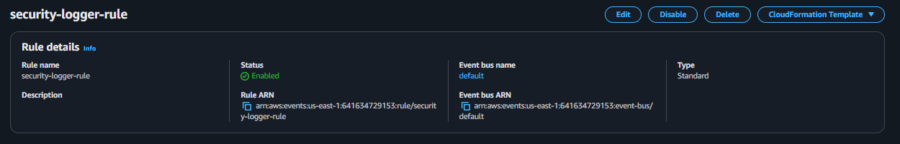
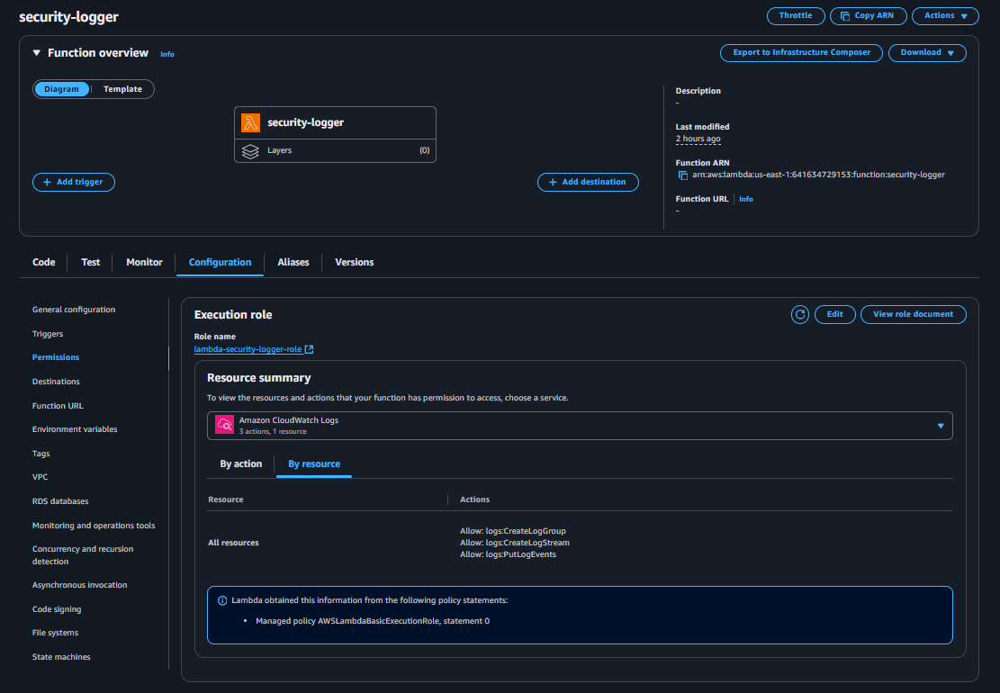

# AWS Serverless Security Logger 🔐

This project implements a **serverless security logging and alerting system** using **AWS EventBridge, Lambda, CloudTrail, CloudWatch, and SNS**.

It monitors critical AWS account activity (e.g., IAM changes, login failures, CloudTrail tampering, world-open Security Groups) and sends **real-time email alerts** when suspicious events occur.

---

## 🚀 Architecture

- **CloudTrail** – captures all API activity  
- **EventBridge Rule** – filters for suspicious/interesting events  
- **Lambda Function** – processes events, logs them, and publishes alerts  
- **SNS Topic** – delivers email alerts to security administrators  
- **CloudWatch Logs** – stores structured log output from Lambda  

---

## ⚡ Features

- Detects **IAM changes** (user/role creation, access key changes, policies)
- Flags **CloudTrail tampering** (stop/delete trail, event selector changes)
- Alerts on **world-open Security Groups** (`0.0.0.0/0`)
- Catches **Console logins without MFA** or failures
- Logs **AccessDenied / Unauthorized** API errors
- Sends **email alerts** with detailed context

---

## 🛠 Setup Steps

### 1) Create SNS Topic & Subscription
Create an SNS topic (e.g., `security-alerts`), subscribe your email, and confirm the subscription.


---

### 2) Create Lambda Function
- **Name:** `security-logger`  
- **Runtime:** Python 3.11  
- **Handler:** `lambda_function.lambda_handler`  
- **Code:** `lambda_function.py` (in this repo)


---

### 3) Configure Lambda Environment Variable
Add the SNS topic ARN as an environment variable:

- **Key:** `ALERT_SNS_ARN`  
- **Value:** *your SNS Topic ARN*


---

### 4) Attach IAM Role & Permissions
Execution role: `lambda-security-logger-role`  
Policies:
- `AWSLambdaBasicExecutionRole`
- Custom inline: **AllowPublishToSecurityAlerts** (grants `sns:Publish` to your topic)


---

### 5) Create EventBridge Rule
**Name:** `security-logger-rule`




**Event pattern:**
```json
{
  "detail-type": ["AWS API Call via CloudTrail"],
  "detail": {
    "eventSource": [
      "signin.amazonaws.com",
      "iam.amazonaws.com",
      "ec2.amazonaws.com",
      "s3.amazonaws.com",
      "cloudtrail.amazonaws.com",
      "kms.amazonaws.com"
    ]
  }
}


```
### 6. Generate Events (Test)

Trigger something security-relevant (e.g., CreateUser in IAM).

---

### 7. Receive Email Alert

You’ll get a Security Alert email with event context (user, IP, action, time).

---
## 📊 Example Alert (Email)
```text
[IAM change] CreateUser @ iam.amazonaws.com  
Account: 123456789012  
Region: us-east-1  
User: arn:aws:iam::123456789012:root  
Source IP: 104.174.xx.xx  
Time: 2025-08-24T02:38:47Z  
Request: {"userName":"tim"}  
```
---

## 📂 Repository Structure
```text
aws-serverless-security-logger/
├── src/
│   └── handler.py
├── tests/
│   └── test_handler.py
├── eventbridge_patterns/
│   ├── iam_changes.json
│   ├── console_login_failures.json
│   └── ec2_open_sg.json
├── iam_policies/
│   └── lambda_least_privilege.json
├── examples/
│   └── structured_log_example.json
├── docs/
│   └── costs-and-cleanup.md
├── template-sam.yaml
├── requirements-dev.txt
├── LICENSE
├── .gitignore
└── README_badges_snippet.md

```
---

## ✅ Summary

A lightweight, cost-effective, serverless security monitoring workflow using native AWS services. Great starting point for cloud security automation and alerting.

---

## 👨‍💻 Created by Andres Sanchez

