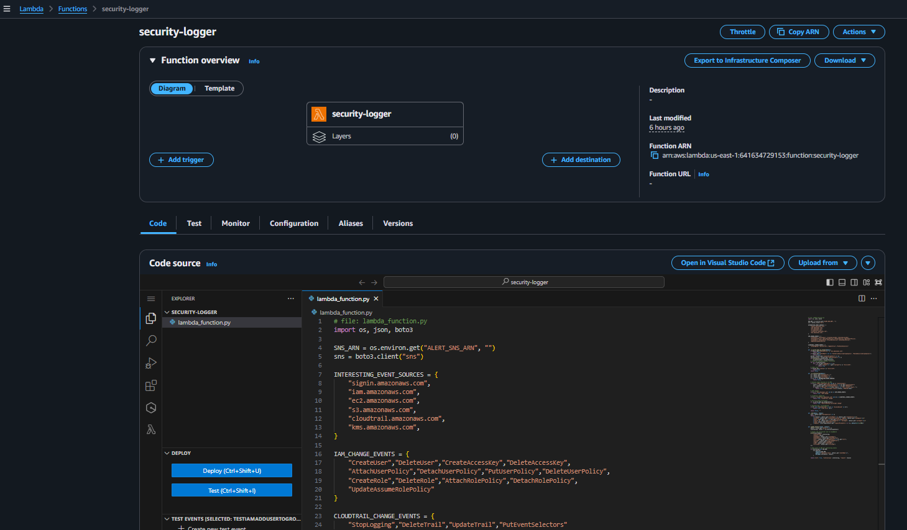
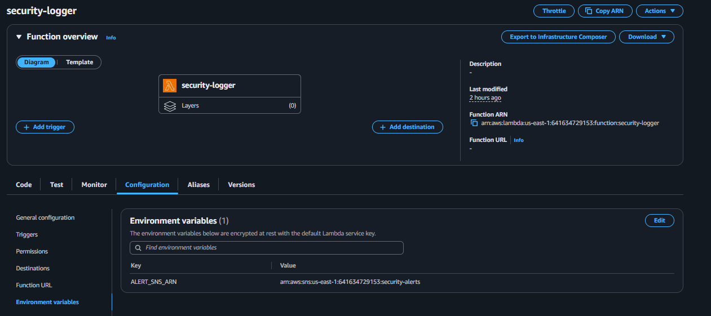
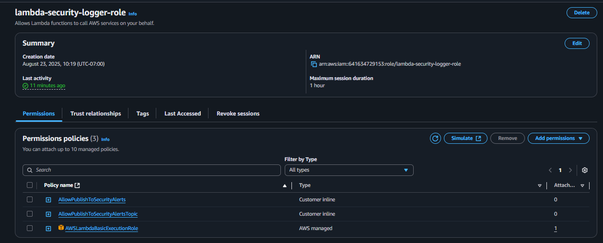

# AWS Serverless Security Logger 🔐  

This project implements a **serverless security logging and alerting system** using **AWS EventBridge, Lambda, CloudTrail, CloudWatch, and SNS**.  

It monitors critical AWS account activity (e.g., IAM changes, login failures, CloudTrail tampering, world-open Security Groups) and sends **real-time email alerts** when suspicious events occur.  

---

## 🚀 Architecture  

- **CloudTrail** – captures all API activity.  
- **EventBridge Rule** – filters for suspicious/interesting events.  
- **Lambda Function** – processes events, logs them, and publishes alerts.  
- **SNS Topic** – delivers email alerts to security administrators.  
- **CloudWatch Logs** – stores structured log output from Lambda.  

---

## ⚡ Features  

- Detects **IAM changes** (user/role creation, access key changes, policies).  
- Flags **CloudTrail tampering** (stop/delete trail, event selector changes).  
- Alerts on **world-open Security Groups** (`0.0.0.0/0`).  
- Catches **Console logins without MFA** or failures.  
- Logs **AccessDenied / Unauthorized** API errors.  
- Sends **email alerts** with detailed context.  

---

## 🛠 Setup Steps  

### 1. Create SNS Topic & Subscription  
Created `security-alerts` SNS topic. Subscribed via email and confirmed subscription.  
  

---

### 2. Create Lambda Function  
Function: `security-logger`  
Runtime: Python 3.11  
Handler: `lambda_function.lambda_handler`  
Code: `lambda_function.py` (included in this repo)  
  

---

### 3. Configure Lambda Environment Variable  
Added:  
- **Key:** `ALERT_SNS_ARN`  
- **Value:** `<SNS Topic ARN>`  
  

---

### 4. Attach IAM Role & Permissions  
Role: `lambda-security-logger-role`  
Policies:  
- `AWSLambdaBasicExecutionRole`  
- Custom: `AllowPublishToSecurityAlerts` (SNS:Publish to topic)  
  

---

### 5. Create EventBridge Rule  
Name: `security-logger-rule`  
Event Pattern:  
```json
{
  "detail-type": ["AWS API Call via CloudTrail"],
  "detail": {
    "eventSource": [
      "signin.amazonaws.com",
      "iam.amazonaws.com",
      "ec2.amazonaws.com",
      "s3.amazonaws.com",
      "cloudtrail.amazonaws.com",
      "kms.amazonaws.com"
    ]
  }
}


```
### 6. Generate Events (Test)

Example: CreateUser in IAM triggered an alert.

---

### 7. Receive Email Alert

Alert email included event details (user, IP, action, time).

---
## 📊 Example Alert (Email)
```text
[IAM change] CreateUser @ iam.amazonaws.com  
Account: 123456789012  
Region: us-east-1  
User: arn:aws:iam::123456789012:root  
Source IP: 104.174.xx.xx  
Time: 2025-08-24T02:38:47Z  
Request: {"userName":"tim"}  
```
---

## 📂 Repository Structure
```text
aws-serverless-security-logger/
│── lambda_function.py       # Lambda function code
│── README.md                # Project documentation
│── images/                  # Screenshots of setup & results
│   ├── 01-sns-topic.png
│   ├── 02-lambda-code.png
│   ├── 03-lambda-env-var.png
│   ├── 04-lambda-role-perms.png
│   ├── 05-eventbridge-rule.png
│   ├── 07-eventbridge-pattern.png
│   ├── 10-cloudtrail-event.png
│   ├── LOG-EVENTS.png
│   ├── 07-email-alert.png
```
---

## ✅ Summary

This project demonstrates how to build a real-time AWS security monitoring system using only serverless services.
It’s lightweight, cost-effective, and a great example of cloud security automation.

---

## 👨‍💻 Created by Andres Sanchez

